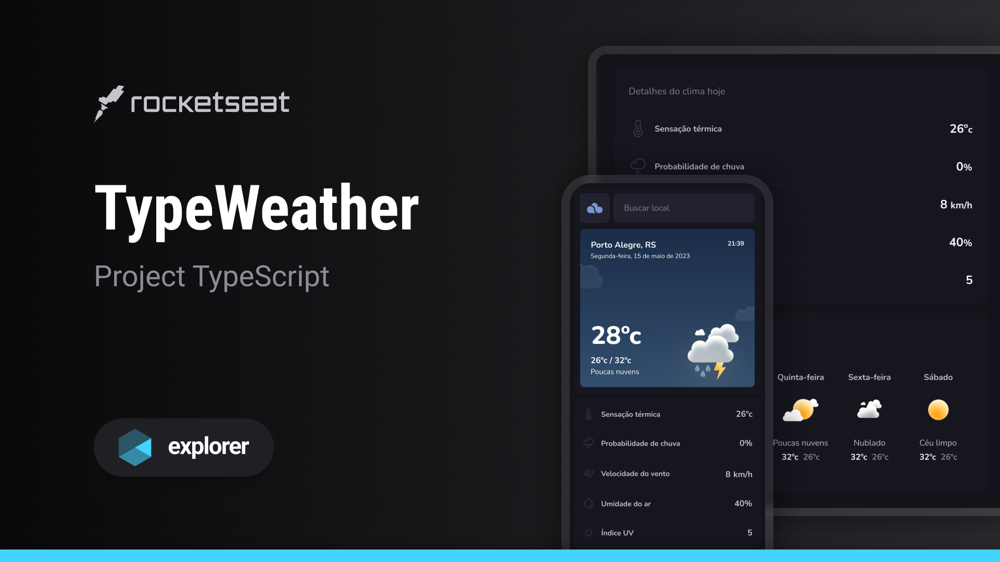

<h1 align="center"> TypeWeather </h1>

Este é um projeto bônus para o Projeto Explorer da Rocketseat, uma aplicação de previsão do tempo que foi convertido de JavaScript (JS) para TypeScript (TS). O principal objetivo dessa conversão é aprimorar a robustez, a escalabilidade e a manutenibilidade do código, aproveitando os benefícios oferecidos pelo TypeScript.

  <a href="#-tecnologias">Tecnologias</a>&nbsp;&nbsp;&nbsp;|&nbsp;&nbsp;&nbsp;
  <a href="#-projeto">Projeto</a>&nbsp;&nbsp;&nbsp;|&nbsp;&nbsp;&nbsp;
  <a href="#-layout">Layout</a>

  

## 🚀 Tecnologias

Esse projeto foi desenvolvido com as seguintes tecnologias:

- TypeScript
- React
- Vite
 

## 💻 Projeto

TypeWeather é uma aplicação de previsão do tempo que fornece informações essenciais para o planejamento do seu dia. Com uma interface intuitiva e visualmente atraente, o aplicativo fornece detalhes climáticos cruciais, incluindo a temperatura atual, as temperaturas mínimas e máximas previstas, a probabilidade de chuva, a velocidade do vento, a umidade, o índice UV e uma previsão do tempo abrangente para 5 dias. Aproveite a precisão da previsão para tomar decisões informadas e estar preparado para qualquer condição climática.
 

## 🔖 Layout

Você pode visualizar o layout do projeto através [DESSE LINK](https://www.figma.com/community/file/1270841135856047223). É necessário ter conta no [Figma](https://figma.com) para acessá-lo.